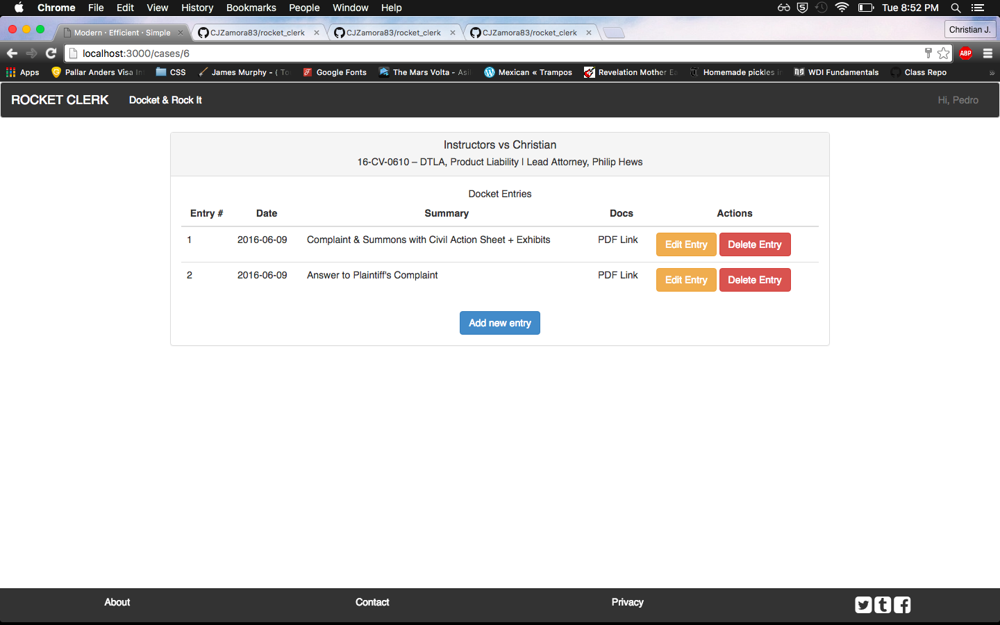

#_*ROCKET CLERK*_

Rocket Clerk is a growing web application that serves as docketing software which is a Docket Clerk, typically working at a large scale law firm, would use to process filed items from a court docket into an internal system so as to keep track of filed documents, scheduling orders, generating a calendar of court appearances and filing deadlines, etc.

As a former Assistant Managing Clerk for a very well known and regarded law firm in Manhattan, one of my primary duties was that of a dedicated docket clerk.  While the process is less than exciting and, quite frankly, mundane, the workflow of a docket clerk using the some of the unwieldly applications that are widely used in the industry.  The applications themselves work but their user interfaces are all but antiquated, inefficient by today's standards, and cannot be customized in any way, shape, or form.

Example:

Therefore, Rocket Docket is, ultimately, meant to do more than perform the same functions as some of the other docketing software.  It is supposed to take into consideration a Docket Clerk's experience and minimize the amount of effort necessary to perform any given task.  The experience should be about fluidity and ease along with a tad of personalization for each and every user (Customized settings features to follow in the future).

This is what it looks like (for now):

###Start Using
 [Start Rockin'](https://warm-island-81233.herokuapp.com/)

###TRELLO
My wireframing notes can be observed on my Trello project page at:

 [Rocket Clerk](https://trello.com/b/dOdDEb3N/rocket-clerk)
 
###Technologies:
>- HTML5/CSS3  
>- Bootstrap  
>- Ruby on Rails 
>- Font-Awesome
>- jQuery

###Contributors
The following individuals assisted me immensely with the development of this game and contributed code and/or revisions to my initial code:
>[Ezra Raez](https://github.com/EARnagram)        
>[Jim Clark](https://github.com/jim-clark)  
>[Phil Hughes](https://github.com/h4w5)  
>- Almost everyone in WDI-DTLA10
>
>###Future Updates
>There is so much to add to this if it were to be utilized by a real world law firm that it would become Gmail-level complex.  Some things would be though:
>
>1. Add a litigation team to case as opposed to one user  
>2. Add an e-mail function to distribution lists (litigation team of one senior lawyer, associate lawyers, assistants/paralegals)
>  
>  
-Christian Zamora
